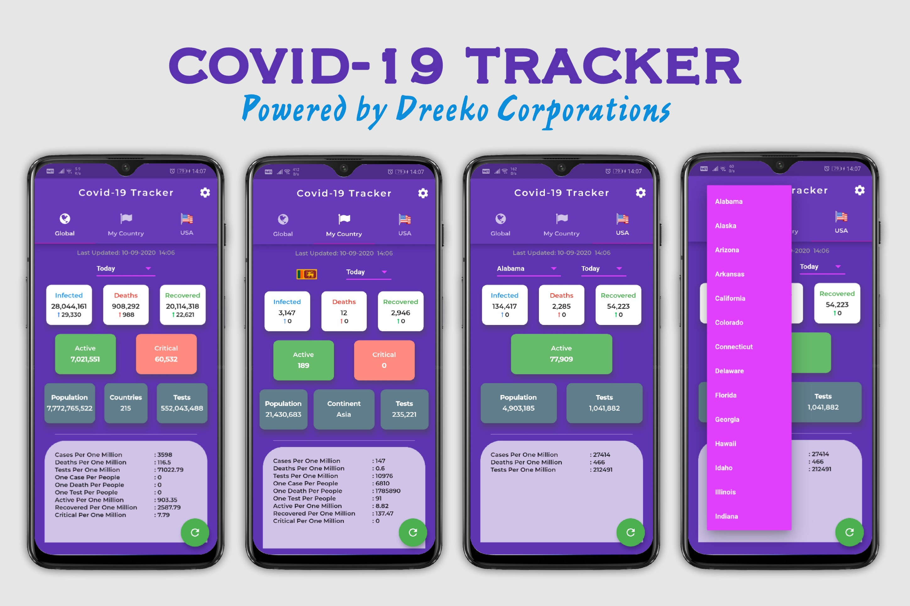
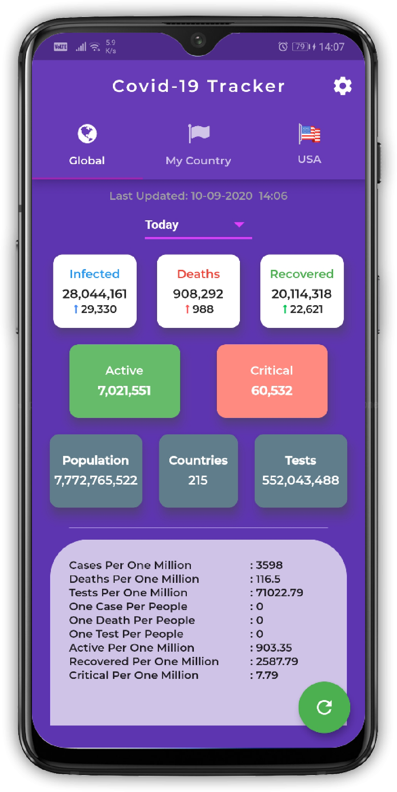
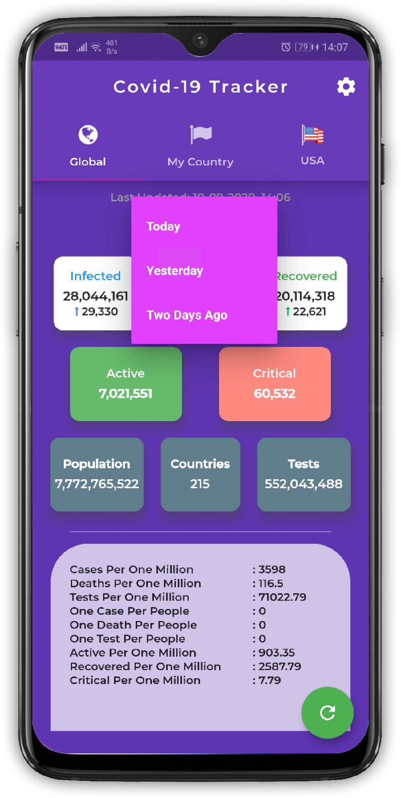
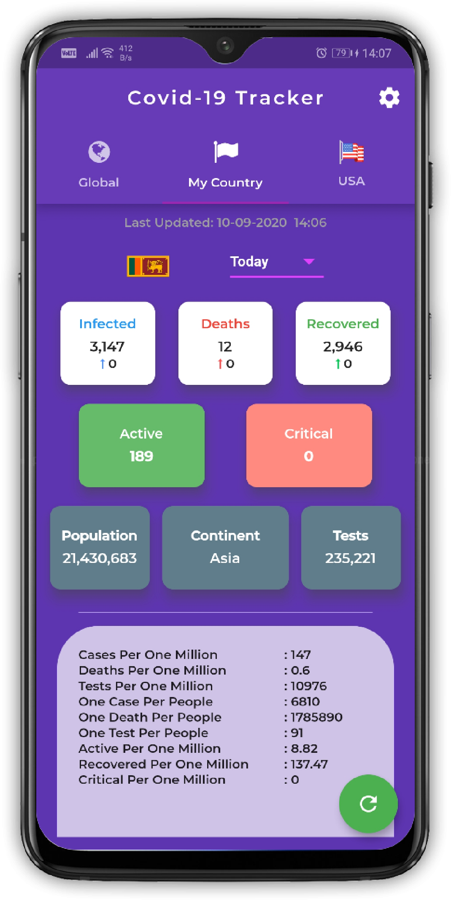
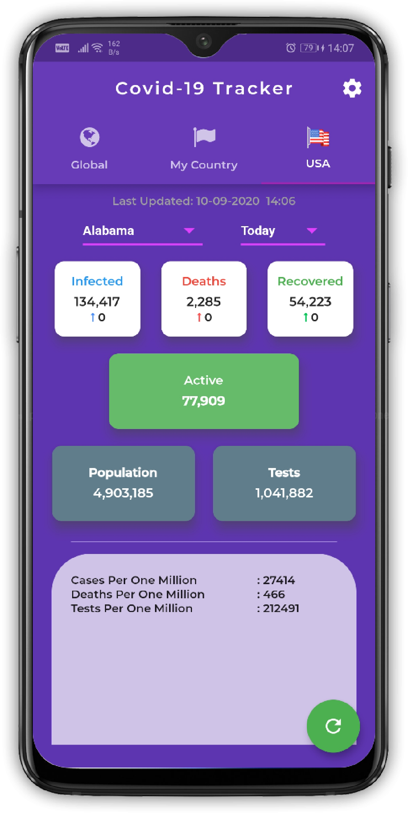
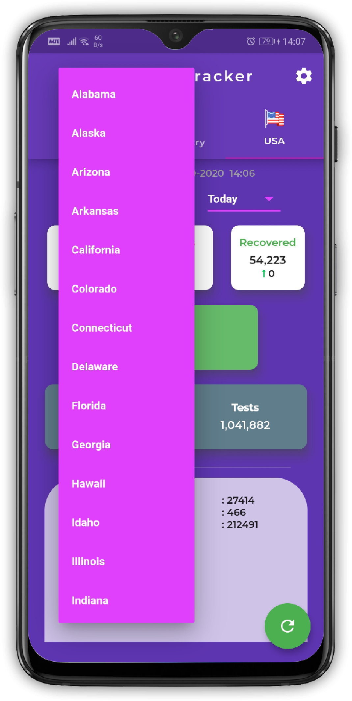
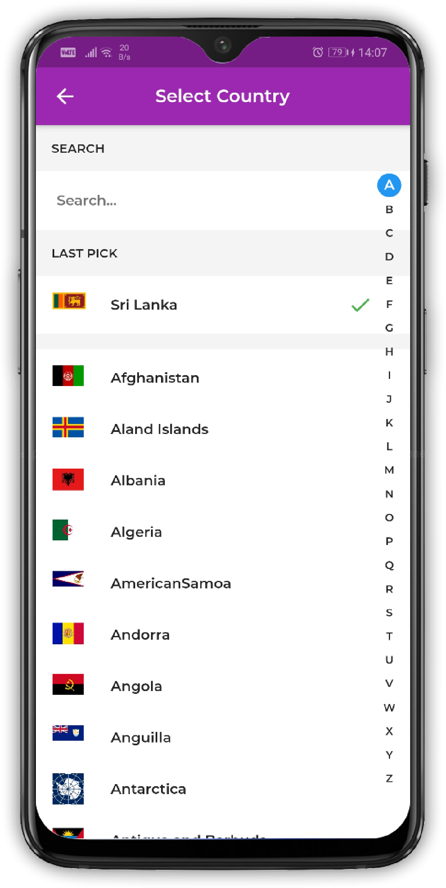
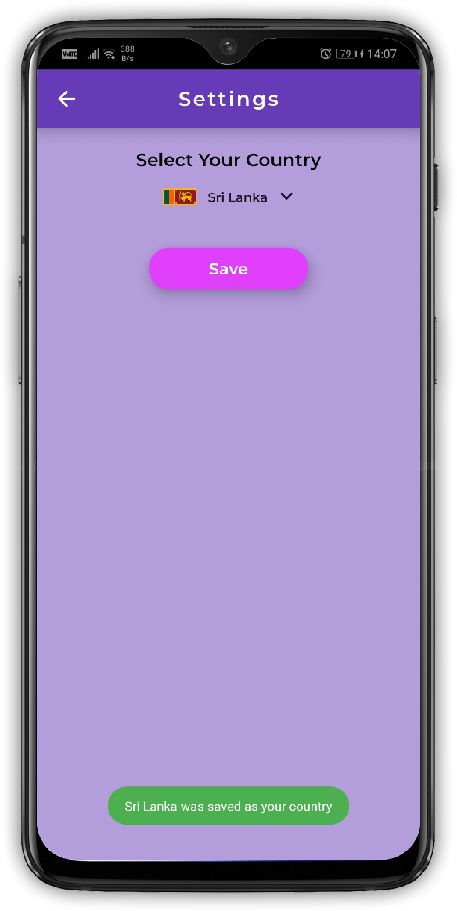

<h1 align="center">Welcome to Flutter Covid-19 Tracker 👋</h1>

<p align="center">
  
  <a>
    
  </a>
  <a>
    
  </a>
  <a href="http://makeapullrequest.com">
    
  </a>
  <a href="https://linkedin.com/in/harshana-rathnayaka">
  
  </a>
</p>

***Star ⭐ the repo if you like what you see. 😎***



> ***A Covid-19 Tracker made with Flutter to keep you updated on the current situation around the world***

---

## 👷‍♂️ Built With

* [Flutter](https://flutter.dev)
* [NOVEL CoVID19 API](https://disease.sh/)

## ✨ Requirements
* Any Operating System (ie. MacOS X, Linux, Windows)
* Any IDE with Flutter SDK installed (ie. IntelliJ, Android Studio, VSCode etc.)
* A little knowledge of Dart and Flutter

## 🔨 Installation

- Follow the below steps to get up and running
- Run the following `commands` inside Visual Studio Code or any other IDE which has a terminal or you can just use `cmd`

> 👯 Clone the repository

- Clone this repo to your local machine using `https://github.com/Harshana-Rathnayaka/Covid19-Tracker`

```shell
$ git clone https://github.com/Harshana-Rathnayaka/Covid19-Tracker
```

> 🏃‍♂️ Run and test the application
- Run the following commands to run and test the application in an emulator or a real device
```dart
$ flutter pub get
$ flutter run
```

## 📸 Screenshots

&nbsp;&nbsp;&nbsp;&nbsp;&nbsp;&nbsp;&nbsp;&nbsp;&nbsp;&nbsp;&nbsp;&nbsp;&nbsp;&nbsp;&nbsp;&nbsp;&nbsp;&nbsp;&nbsp;&nbsp;  </br> </br> </br>
&nbsp;&nbsp;&nbsp;&nbsp;&nbsp;&nbsp;&nbsp;&nbsp;&nbsp;&nbsp; &nbsp;&nbsp;&nbsp;&nbsp;&nbsp;&nbsp;&nbsp;&nbsp;&nbsp;&nbsp; </br> </br> </br>
&nbsp;&nbsp;&nbsp;&nbsp;&nbsp;&nbsp;&nbsp;&nbsp;&nbsp;&nbsp;&nbsp;&nbsp;&nbsp;&nbsp;&nbsp;&nbsp;&nbsp;&nbsp;&nbsp;&nbsp;&nbsp;&nbsp;&nbsp;&nbsp;&nbsp;&nbsp;&nbsp;&nbsp;&nbsp;&nbsp;&nbsp;&nbsp;&nbsp;&nbsp;&nbsp;&nbsp;&nbsp;&nbsp;&nbsp;&nbsp;&nbsp;&nbsp;&nbsp;&nbsp;&nbsp;&nbsp;&nbsp;&nbsp;&nbsp;&nbsp;&nbsp;&nbsp;&nbsp;&nbsp;&nbsp;&nbsp;&nbsp;&nbsp;&nbsp;&nbsp;

## 🤓 Author
**Harshana Rathnayaka** 
<br>


## 🤝 Contributing

**Contributions, issues and feature requests are welcome** !<br />Feel free to check out the [issues page](https://www.coolflutter.com/).

## 📝 License


- **[MIT license](http://opensource.org/licenses/mit-license.php)**
- Copyright 2020 © <a href="http://fb.com/DreekoCorporations" target="_blank">Dreeko Coporations</a>.
